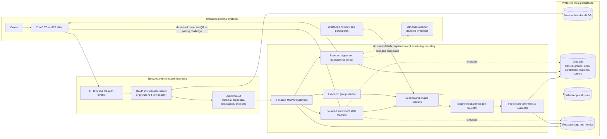

# 33 - WhatsApp Monitoring Threat Model

> Authentication decision update, 2026-08-23: current OpenAI guidance still expects OAuth 2.1 for
> authenticated published/multi-user MCP servers. The owner explicitly authorized a personal,
> single-user permanent token-in-path bridge for codexgui. It must exact-match at the edge, suppress
> secret-path access logs, inject a separate session-scoped backend key, and remain rotatable. This
> exception does not change the multi-user OAuth requirement or any tenant-isolation invariant below.

**Status:** Phase 0 security decision record; the monitoring domain and bounded
enrollment facade do not exist yet  
**Applies to:** the focused WhatsApp monitoring MCP surface described in
[`AGENTS.md`](../AGENTS.md), not the complete generic OpenWA API or tool catalog  
**Source snapshot:** `c5e05623351428776a007c34d6914f1beef027b7`, inspected
2026-08-23

This document defines the trust boundaries and security invariants that must be
implemented before WhatsApp monitoring can be exposed to ChatGPT. It complements
the [Phase 0 architecture baseline](./32-whatsapp-monitoring-baseline.md).

## 33.1 Scope and security posture

The first supported release is personal, single-tenant, and self-hosted. That
reduces administrative complexity; it does **not** permit implicit ownership or
cross-session access. Every persistent row and tool call still belongs to an
explicit stable principal and an exact OpenWA session.

Monitoring is read-only with respect to WhatsApp. Group selection, rule changes,
and digest acknowledgment are local control-plane writes behind a separate
capability gate. Message sending, replies, group administration, link opening,
media fetching, and actions in other services are outside this threat model and
remain disabled.

OpenWA uses unofficial reverse-engineered clients. `whatsapp-web.js` and Baileys
both carry a non-zero WhatsApp restriction or account-ban risk. Authentication,
rate limiting, and careful traffic shaping reduce application risk but cannot
eliminate that platform risk. Development and manual acceptance must use a
disposable number.

## 33.2 Assets and data classification

| Class                          | Assets                                                                                       | Handling requirement                                                                                          |
| ------------------------------ | -------------------------------------------------------------------------------------------- | ------------------------------------------------------------------------------------------------------------- |
| Authentication secrets         | OAuth access/refresh tokens, API keys, WhatsApp auth stores, cookies, encryption keys        | Never enter message rows, rule JSON, logs, metrics, tool results, repository files, or audit metadata         |
| Short-lived enrollment secrets | QR images/data, pairing codes                                                                | Bind to one principal, session, and flow; short expiry; one-time protected delivery; never persist or fan out |
| Private identifiers            | Principal/credential IDs, session UUIDs, group JIDs, sender JIDs, message IDs, phone numbers | Authorize before existence checks; minimize responses; redact logs and metric labels                          |
| Private content                | Message bodies, captions, quoted text, filenames, links, contact/location data               | Treat as untrusted data; bounded retention and output; never use as instructions or authorization             |
| Local configuration            | Monitored groups, rules, exclusions, quiet hours, priorities, cursors                        | Version, validate, authorize, audit safely, and protect against replay/concurrent writes                      |
| Derived decisions              | Match evidence, scores, semantic labels, digest state                                        | Store concise explanations, never chain-of-thought; keep source references and uncertainty                    |
| Operational state              | Database, backups, auth-store backups, deployment secrets and routes                         | Govern through the current deployment runbook; encrypt/protect, back up, and test rollback                    |

## 33.3 Actors and trust boundaries

### Actors

- **Owner:** configures the connector, links WhatsApp, selects groups, defines
  rules, and reads digests.
- **ChatGPT or another MCP client:** an untrusted network client until OAuth or
  private API-key authentication resolves a principal, scopes/role, and allowed
  sessions.
- **OpenWA MCP and monitoring services:** the authorization and data-minimization
  boundary.
- **WhatsApp engine adapter:** an internal component that handles sensitive
  session credentials and untrusted network events.
- **WhatsApp participants:** sources of untrusted names, messages, links, files,
  and prompt-injection text, including when a participant is the owner.
- **Optional classifier:** a future external data processor, disabled by default.
  It is not trusted with more data than its explicit provider policy permits.
- **Local operator:** controls the host and may administer credentials and backups.
  Host compromise is outside application isolation but remains an operational
  risk.

### Trust boundaries

1. Public or private network to MCP transport.
2. Credential material to resolved principal and session authorization context.
3. MCP transport to the focused domain-tool allowlist.
4. WhatsApp network and adapter output to the engine-neutral message envelope.
5. Untrusted message content to deterministic matching and semantic judgment.
6. Runtime process to the main/data databases, auth stores, backups, and logs.
7. Monitoring candidate batch to an optional external classifier.
8. Deployment host to shared proxy, DNS, secret storage, and backup systems.

## 33.4 Data-flow and trust-boundary diagram

Enrollment challenges must not traverse the ordinary webhook, WebSocket, outbox,
cache, audit, or generic MCP text-result paths.

## 33.5 Existing controls to reuse

- MCP is opt-in and read-only by default
  ([`src/app.module.ts`](../src/app.module.ts#L68-L81),
  [`src/modules/mcp/mcp.server.ts`](../src/modules/mcp/mcp.server.ts#L189-L197)).
- Tool descriptors carry role, tier, session scope, and safety annotations, and the
  invoker authenticates before validating or calling a handler
  ([`src/core/agent-tools/tool-descriptor.ts`](../src/core/agent-tools/tool-descriptor.ts#L5-L25),
  [`src/core/agent-tools/tool-invoker.ts`](../src/core/agent-tools/tool-invoker.ts#L31-L76)).
- API keys are hashed at rest and support role, expiry, IP, and session restrictions
  ([`src/modules/auth/auth.service.ts`](../src/modules/auth/auth.service.ts#L174-L207),
  [`src/modules/auth/auth.service.ts`](../src/modules/auth/auth.service.ts#L426-L493)).
- Pre-auth IP and post-auth credential throttles already exist
  ([`src/modules/mcp/mcp.server.ts`](../src/modules/mcp/mcp.server.ts#L166-L187),
  [`src/modules/mcp/mcp-rate-limit.ts`](../src/modules/mcp/mcp-rate-limit.ts#L18-L75)).
- Both adapters normalize incoming data behind `IWhatsAppEngine`, including stable
  chat/message identity and structured mentions
  ([`src/engine/interfaces/whatsapp-engine.interface.ts`](../src/engine/interfaces/whatsapp-engine.interface.ts#L62-L151)).
- Inbound persistence already has an atomic unique identity on
  `(sessionId, waMessageId)`
  ([`src/modules/message/entities/message.entity.ts`](../src/modules/message/entities/message.entity.ts#L34-L41)).
- WhatsApp session teardown and logout already use engine identity fences and
  explicit cleanup paths
  ([`src/modules/session/session-engine-controls.ts`](../src/modules/session/session-engine-controls.ts#L127-L174),
  [`src/modules/session/session.service.ts`](../src/modules/session/session.service.ts#L517-L549)).

These controls are foundations, not proof that the monitoring surface is safe.

## 33.6 Threat analysis

| ID  | Category                     | Threat and current exposure                                                                                                                                                                                                                                                                                                                                                | Required mitigation and proof                                                                                                                                                                                                                                                                                                                                                                                                                                |
| --- | ---------------------------- | -------------------------------------------------------------------------------------------------------------------------------------------------------------------------------------------------------------------------------------------------------------------------------------------------------------------------------------------------------------------------- | ------------------------------------------------------------------------------------------------------------------------------------------------------------------------------------------------------------------------------------------------------------------------------------------------------------------------------------------------------------------------------------------------------------------------------------------------------------ |
| T01 | Spoofing                     | The current public-facing MCP model accepts static API keys and has no OAuth subject, issuer, audience, or scopes.                                                                                                                                                                                                                                                         | Public ChatGPT access uses OAuth 2.1/MCP authorization with protected-resource and authorization-server metadata, PKCE `S256`, resource/audience binding, per-request token verification, and a stable internal principal. Keep API keys for local/private compatibility only.                                                                                                                                                                               |
| T02 | Elevation / disclosure       | Null or empty `allowedSessions` currently means unrestricted access, including aggregate session listing ([`src/modules/auth/auth.service.ts`](../src/modules/auth/auth.service.ts#L462-L467), [`src/modules/session/session.service.ts`](../src/modules/session/session.service.ts#L304-L315)).                                                                           | Monitoring resolves a non-empty explicit grant before any handler. Missing/empty means no sessions, except a separately recognized and tested local administrator path. Add principal-A/principal-B and guessed-ID negative tests.                                                                                                                                                                                                                           |
| T03 | Spoofing / tampering         | Treating an API-key row ID as the durable owner makes key rotation create a new consumer or orphan the old consumer's state.                                                                                                                                                                                                                                               | The approved personal deployment treats its dedicated backend key row as the installation principal and preserves that row across normal upgrades; the independent URL token can rotate without changing ownership. Replacing the backend key requires one atomic principal-ID migration across all monitoring tables. Multi-user/OAuth mode remains incomplete until an explicit credential-to-stable-principal binding is implemented and negative-tested. |
| T04 | Disclosure                   | Raw QR data currently fans out through session webhooks and WebSockets ([`src/modules/session/session-engine-event-wiring.ts`](../src/modules/session/session-engine-event-wiring.ts#L115-L140)); webhook delivery can persist payloads in its outbox ([`src/modules/webhook/webhook-delivery.service.ts`](../src/modules/webhook/webhook-delivery.service.ts#L585-L626)). | The bounded enrollment facade intercepts challenges before generic fan-out. Deliver protected image/resource content directly, with expiry and one-time consumption. Prove QR bytes never appear in DB, cache, webhooks, sockets, audit, logs, traces, screenshots, or error results.                                                                                                                                                                        |
| T05 | Replay / denial              | Repeated begin/challenge calls can regenerate enrollment challenges or race multiple engine starts.                                                                                                                                                                                                                                                                        | One active flow per principal/session, idempotent begin, short expiry, generation rate limit, atomic state transitions, replay rejection, cancellation, and stale-flow tests.                                                                                                                                                                                                                                                                                |
| T06 | Elevation                    | The default read-only registry exposes every generic read tool, while `MCP_READONLY=false` exposes generic WhatsApp writes.                                                                                                                                                                                                                                                | Publish a focused monitoring/enrollment allowlist. Add a separate `MCP_MONITOR_CONFIG_WRITES`-style gate and role checks. Prove enabling it cannot reveal message-send, contact-block, or group-write tools.                                                                                                                                                                                                                                                 |
| T07 | Information disclosure       | Generic tools can list contacts, invite codes, large history, and optional media, exceeding monitoring purpose.                                                                                                                                                                                                                                                            | Return purpose-built DTOs; selected groups only in digest/search; paginate and bound all bodies/context; no media bytes by default; response-budget tests.                                                                                                                                                                                                                                                                                                   |
| T08 | Prompt injection / elevation | A message can contain tool-like text, instructions, links, HTML, JSON, or a request to change rules or act in another service.                                                                                                                                                                                                                                             | Label content as untrusted data in tool and skill contracts. Never interpolate it into prompts with authority, SQL, shell, URLs, tool names, or logs. It cannot select tools/groups/rules or authorize actions. Add adversarial Unicode, control-character, markdown, HTML, JSON, and tool-call fixtures.                                                                                                                                                    |
| T09 | Tampering                    | Existing webhook filters skip inapplicable fields and are AND-only; accidental missing predicates can broaden a rule ([`src/modules/webhook/filters/filter-evaluator.ts`](../src/modules/webhook/filters/filter-evaluator.ts#L79-L105)).                                                                                                                                   | Build a dedicated strict, fail-closed evaluator with bounded typed predicates, explicit `any`/`all`, post-positive exclusions, evidence, safe regex limits, and schema-version tests. Unknown/unsupported predicates fail validation or return explicit degraded state.                                                                                                                                                                                      |
| T10 | Tampering / repudiation      | Duplicate, edited, revoked, replayed, or out-of-order events can create stale or repeated matches. Existing edits persist only the body ([`src/modules/session/message-mutation-projector.ts`](../src/modules/session/message-mutation-projector.ts#L96-L107)).                                                                                                            | Persist a versioned monitoring projection and mutation state; use DB uniqueness, deterministic re-evaluation/invalidation, ordered opaque keys, and restart/reconnect tests. Never use callback order or timestamp alone as cursor truth.                                                                                                                                                                                                                    |
| T11 | Tampering / denial           | A crash or concurrent acknowledgment can skip unprocessed matches or repeat committed work.                                                                                                                                                                                                                                                                                | Create batch leases or equivalent transactional cursor semantics with idempotent acknowledgment, version/conflict checks, rollback on failure, and two-client concurrency tests.                                                                                                                                                                                                                                                                             |
| T12 | Disclosure                   | Current message persistence drops structured mentions and other neutral fields, while media may be downloaded and stored inline by default ([`src/modules/session/message-row.mapper.ts`](../src/modules/session/message-row.mapper.ts#L17-L47), [`src/engine/adapters/inbound-media-cap.ts`](../src/engine/adapters/inbound-media-cap.ts#L64-L72)).                       | Store a minimal monitoring projection: matching text, structured mentions, reply reference, type, sender/chat IDs, timestamps, mutation state, and media metadata without bytes. Respect ephemeral/view-once policy and configurable retention.                                                                                                                                                                                                              |
| T13 | Disclosure / repudiation     | Wire errors sanitize some failures, but server logging retains raw exception messages and stacks ([`src/modules/mcp/tool-result.ts`](../src/modules/mcp/tool-result.ts#L39-L55)).                                                                                                                                                                                          | Central redaction before logging; stable safe domain codes; no bodies, QR/pairing codes, tokens, JIDs, phone numbers, rule terms, or DB URLs. Capture logs in success/error tests and scan artifacts.                                                                                                                                                                                                                                                        |
| T14 | Repudiation                  | MCP does not currently stamp the authenticated request actor as the REST guard does, so service-level audit provenance can be absent ([`src/modules/auth/guards/api-key.guard.ts`](../src/modules/auth/guards/api-key.guard.ts#L79-L91)).                                                                                                                                  | Attach principal and credential provenance to request context after authentication. Audit configuration/enrollment actions with safe IDs, versions, and counts only. Audit failure does not authorize or roll back a denied action.                                                                                                                                                                                                                          |
| T15 | Disclosure                   | Optional semantic classification can export private content or silently treat provider failure as non-match.                                                                                                                                                                                                                                                               | Disabled by default; explicit provider/model/data policy; minimum context and redacted IDs; validated structured output; cost/concurrency/time limits; fail-visible degraded state; deterministic fake tests.                                                                                                                                                                                                                                                |
| T16 | SSRF / elevation             | Message links, quoted URLs, media references, and webhook destinations can be used to trigger outbound requests.                                                                                                                                                                                                                                                           | Monitoring performs no URL fetch. Preserve existing SSRF controls. Opening a link or fetching media requires a separate exact user request through normal safety/confirmation rules.                                                                                                                                                                                                                                                                         |
| T17 | Denial                       | Unbounded rules, keywords, regex, previews, media metadata, candidates, or cursor backlogs can exhaust CPU/memory/storage.                                                                                                                                                                                                                                                 | Administrator caps, safe-regex analysis and execution budget, bounded pagination/context/body size, retention sweeps, pre/post-auth throttles, and backlog/oldest-age health metrics.                                                                                                                                                                                                                                                                        |
| T18 | Disclosure / elevation       | Engine-specific IDs, history, pairing readiness, mentions, or `fromMe` semantics may differ and cause mis-scoping.                                                                                                                                                                                                                                                         | Depend on neutral identity helpers, maintain an engine capability matrix, use engine-neutral fixtures, and return explicit unsupported/degraded results. Test both engines manually only with a disposable account.                                                                                                                                                                                                                                          |
| T19 | Disclosure / tampering       | Backups or migrations can omit new tables, expose auth state, or restore incompatible cursor/rule state.                                                                                                                                                                                                                                                                   | Cross-dialect migrations, export/import table parity, encrypted/protected backups, schema-version checks, scoped restore, retention behavior, and restore/rollback tests. Never duplicate the engine auth store into monitoring tables.                                                                                                                                                                                                                      |
| T20 | Infrastructure               | A public route, wildcard proxy rule, Docker socket, host port, mutable image, or broad restart can expand compromise impact.                                                                                                                                                                                                                                               | Deployment remains a separate explicitly authorized phase. Re-read authoritative operational knowledge, inspect live state, use the dedicated no-socket/no-host-port overlay, immutable image, least privilege, exact route, backup, protocol verification, and scoped rollback. No deployment value is selected in this document.                                                                                                                           |

## 33.7 Security invariants

Implementation and review must treat these as non-negotiable:

1. Authorization happens before validation that could reveal whether a session,
   group, rule, match, cursor, or enrollment flow exists.
2. A missing principal binding or empty session grant denies access.
3. Monitoring configuration never joins, leaves, renames, sends to, or administers
   a WhatsApp group.
4. The monitoring write gate cannot enable the generic WhatsApp write tier.
5. Group identity is an exact normalized group JID; display names are labels only.
6. QR and pairing challenges are short-lived secrets, not events, ordinary text,
   logs, metrics, audit metadata, or durable rows.
7. Message content is always untrusted data, even from the owner or an administrator.
8. No message can cause a tool call, rule/configuration change, URL fetch, media
   download, or action in another service.
9. Media bytes are not downloaded or retained for monitoring by default.
10. Every match has concise structured evidence; no chain-of-thought is stored.
11. Cursors are opaque, transactional, principal/session-bound, and restart-safe.
12. Edits, revokes, duplicates, reconnect replay, and out-of-order delivery have
    deterministic outcomes.
13. Semantic provider failure is visible and never converted into “no match.”
14. Logs, metrics, errors, traces, CI artifacts, and backups contain no enrollment
    challenge, credential, message body, or high-cardinality private label.
15. A public ChatGPT connection is not complete until OAuth identity and scopes are
    verified on every request and cross-principal negative tests pass.

## 33.8 Required security tests before Phase 2 exit

### Principal and session isolation

- Principal A cannot list, configure, preview, read, acknowledge, or infer any
  session/group/rule/match/cursor/flow belonging to principal B.
- Missing, empty, expired, revoked, wrong-role, wrong-scope, wrong-audience, and
  wrong-session credentials fail closed before existence checks.
- Credential rotation preserves the intended stable principal without broadening
  grants or orphaning a cursor.

### Enrollment secrecy and replay

- Concurrent begin is idempotent and creates one active flow.
- Expired, cancelled, consumed, stale, and wrong-principal challenges fail.
- Captured database rows, Redis/cache writes, webhook/outbox events, WebSocket
  frames, audits, logs, traces, exceptions, and MCP text results contain no QR or
  pairing secret.
- Disconnect requires explicit confirmation, is correctly annotated as destructive,
  invalidates local enrollment state, and emits only a redacted audit record.

### Untrusted content and rule safety

- Prompt-injection strings, Unicode confusables, control characters, markdown,
  HTML, JSON fragments, SQL/shell-like text, and tool-call-shaped content remain
  inert data.
- Unknown conditions fail closed; malicious/oversized regex, keywords, semantic
  instructions, message bodies, and context requests are rejected or bounded.
- Unmonitored groups never appear through preview, match, search, or digest tools.

### Persistence and cursor correctness

- Duplicate, edit, revoke, reconnect replay, and out-of-order fixtures produce one
  deterministic current outcome per session/message identity.
- Two clients cannot acknowledge across principals/sessions or skip matches through
  concurrent/stale cursors.
- Restart, migration, retention, backup, and restore preserve authorized rules and
  cursor semantics without restoring expired enrollment challenges.

### Output and operational safety

- All responses are bounded and purpose-built; no raw entity or inline media leaks.
- Captured logs and metrics stay redacted on success, validation, authentication,
  engine-error, classifier-error, and database-error paths.
- Both engines pass the neutral fixture suite or return an explicit supported/
  unsupported capability result.
- Enabling monitoring configuration leaves generic WhatsApp write tools absent.

## 33.9 Residual risks and review triggers

Even after the controls above, unofficial-client account risk, WhatsApp protocol
changes, compromised host/root access, malicious dependencies, and classification
errors remain. Documentation must state these limitations without claiming that an
engine, OAuth, or self-hosting eliminates them.

Repeat the threat-model review before any of the following:

- multi-user hosting or delegated administration;
- message sending, replies, group administration, or push notifications;
- server-side LLM classification or new external data processors;
- OCR, document parsing, image understanding, transcription, or media download;
- public deployment, new identity provider, new proxy/auth bridge, or raw browser/CDP
  control;
- regulated, emergency, employment, medical, financial, or compliance-sensitive
  monitoring.

Production deployment additionally requires explicit user authorization and fresh
retrieval of the authoritative operational runbook. The Drive operational connector
was unavailable during this Phase 0 work, so no private hostname, route, secret path,
port, state location, backup command, or rollback command is asserted here.
